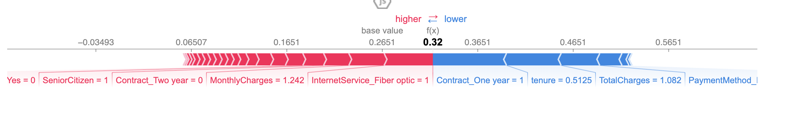

# Customer-Churn-Prediction
ML project to predict telecom customer churn using Random Forest and SHAP

## Objective
To predict whether a telecom customer will churn (i.e., leave the service) based on their demographics and service usage, using a supervised machine learning model.

## Problem Statement
Customer churn is a major issue in the telecom industry. Retaining customers is often more cost-effective than acquiring new ones. This project aims to predict churn and identify key factors influencing customer decisions.

---

## Dataset
- **Source**: [Kaggle - Telco Customer Churn Dataset](https://www.kaggle.com/datasets/blastchar/telco-customer-churn)
- **Size**: 7,032 records
- **Features**: 20+ attributes including:
  - Demographics (gender, senior citizen, partner, dependents)
  - Services (internet, phone, contract type, etc.)
  - Financial (monthly charges, total charges)
  - Target: `Churn` (Yes/No)

---

## Tools & Libraries Used
- **Python 3**
- `pandas`, `numpy` for data wrangling
- `seaborn`, `matplotlib` for EDA & visualization
- `scikit-learn` for machine learning
- `SHAP` for model explainability
- `joblib` to save the final model

---

## Machine Learning Models Tested
- Logistic Regression
- Decision Tree
- Random Forest (Best)
- Cross-validation
- Hyperparameter tuning using GridSearchCV

---

## Final Model: Random Forest Classifier
- **Accuracy**: ~80%
- **Best Parameters**:
  - `max_depth=10`
  - `n_estimators=200`
  - `min_samples_leaf=2`

---

## Key Features Influencing Churn
- `Tenure` (duration of stay)
- `InternetService_FiberOptic`
- `TotalCharges`
- `Contract_TwoYear`
- `PaymentMethod_ElectronicCheck`

---

## SHAP Explainability
SHAP values were used to interpret which features most influenced customer churn, helping the business make actionable decisions.

---

## Model Saving
- The final trained model is saved using `joblib` .
  

